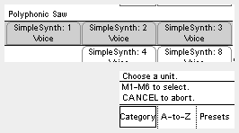
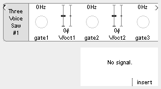

## Simple Synthesizers

A collection of **simple polyphonic synthesizer** units for the ER-301, built and tested on firmware **v0.4.26**.

These units are built utilizing the ER-301 **Middle Layer SDK**. Although they would be easy enough to patch manually through the UI, the SDK gives us an incredible efficiency boost. The three voice unit uses about 13% CPU, which is a significant reduction from what a comparable UI patch would necessitate.

As a result, we can use the simple synthesizers as **macro** units during patch creation, extending the already massive utility of the ER-301.

### Installation
To install, simply download this repo and copy the `SimpleSynth` directory to your SD card under `ER-301/libs`.

The new units will be available on the insert screen.

### Patching Ideas

1. Use an external midi-to-cv module to send multiple gates and pitches to the ER-301 to use it as a true polyphonic synthesizer.

2. Set the gate mode for each voice to "toggle" (simply hold the M button to quickly edit a control) and use the unit as an oscillator+filter bank.

3. Patch a single gate CV to all the voice gates and manually set the V/Oct tuning to trigger chords.

4. Use the fantastic ER-301 hold mode to set different chord values in the unit and manually interpolate between them ala the [THX sound](https://www.youtube.com/watch?v=FWkJ86JqlPA) (with much fewer voices of course :P).

### Parameter Overview

Parameter | Description
--------- | -----------
**gate*N*** | The **gate** input for the **N**th voice. Each voice has it's own ADSR envelope triggered by this gate. Switch this gate to toggle mode to convert the unit into an oscillator bank.
**V/Oct*N*** | The **V/Oct** for the **N**th voice.
**f0** | The **fundamental frequency** for all voices.
**detune** | The **pitch offset** of the second oscillator in all voices. Each voice is comprised of **two saw waves**.
**cutoff** | The **base filter cutoff** for all voices. Each voice has it's own **low-pass ladder filter**.
**Q** | The **filter resonance** for all voices. Starts to self resonate around 0.6.
**fenv** | The **filter envelope amount** for all voices. Determines how much the ADSR for each voice affects the filter **cutoff**. Can also be set to negative values to "duck" the filter.
**A** | The ADSR **attack** value for all voices.
**D** | The ADSR **decay** value for all voices.
**S** | The ADSR **sustain** level for all voices. Can also be used as an overall level control in certain situations.
**R** | The ADSR **release** level for all voices.
