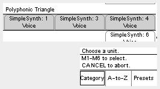
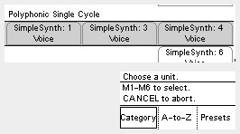
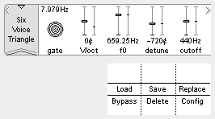
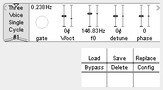
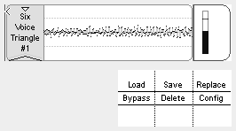
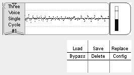
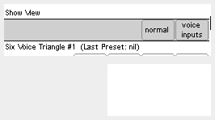
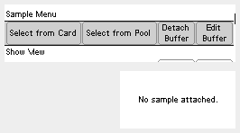
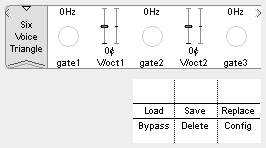

## Polygon (Polyphonic Synth)

A collection of **polyphonic synthesizer** units for the ER-301, built and tested on firmware **v0.4.27**.

These units are built utilizing the ER-301 **Middle Layer SDK**. Although they would be easy enough to patch manually through the UI, the SDK gives us an incredible efficiency boost. The three voice unit uses about 18-20% CPU, which is a significant reduction from what a comparable UI patch would necessitate.

As a result, we can use Polygon as **macro** units during patch creation, extending the already massive utility of the ER-301.

### Installation
To install, simply download this repo and copy the `Polygon` directory to your SD card under `ER-301/libs`.

The new units will be available on the insert screen.

The following units are available:

1. **Polyphonic Saw**
2. **Polyphonic Triangle**
3. **Polyphonic Single Cycle**

Each with 1, 3, 4, and 6 voice variations.

### Patching Ideas

1. Use an external midi-to-cv module to send multiple gates and pitches to the ER-301 to use it as a true polyphonic synthesizer.

2. Set the gate mode for each voice to "toggle" (simply hold the M button to quickly edit a control) and use the unit as an oscillator+filter bank.

3. Patch a single gate CV to all the voice gates and manually set the V/Oct tuning to trigger chords.

4. Use the fantastic ER-301 hold mode to set different chord values in the unit and manually interpolate between them ala the [THX sound](https://www.youtube.com/watch?v=FWkJ86JqlPA) (with much fewer voices of course :P).

5. Create a cheap (as in CPU) bass synth by loading the 1 voice unit and patching your gate input to the **sync** control. Detune the several secondary oscillators to create interesting new waveforms.

6. Patch an arpeggiator into the round robin inputs for hours of fun!

### A Note on Tuning
I created these units using the [Squarp Hermod](https://squarp.net/hermod) to send polyphonic cv out to the ER-301. I noticed that the pitch tracking on my connection doesn't always work perfectly, especially when spanning several octaves.

Luckily there is an easy fix for situations like this. Simply add the built-in unit **Scale Quantizer** to your **V/octR** input to keep everything in tune.

### Controls
The polyphonic controls are organized to put the most common controls in the main view and all extended controls inside of sub-views. For example, to see the individual voice gates, simply move your cursor over the **gateR** control and press **enter**. This will take you to the dedicated gates view where you can assign individual inputs.

In general, pressing enter on a control should take you to whatever related controls are available or send you back to the main view.

Parameter | Desciption
--------- | ----------
**gateR** | A **gate** for each voice by **round robin**. When this **gate** drops the **round robin** advances to the next voice. As a result, playing *legato* through the **round robin** inputs will only use a single voice.
***>>>***   | **gate*N*** : the dedicated **gate** input for the *N*th voice.
**V/octR** | A **V/oct** for each voice by **round robin**.
***>>>*** | **V/oct*N*** : the dedicated **V/oct** input for the *N*th voice. The **V/oct** input for a voice is tracked as long as its **gate** or the **round robin** gate is open on it. If both are active, the **V/oct** inputs are summed.
**syncR** | A **sync** for each voice by **round robin**. When triggered, this control **sync**s the oscillators in the currently active voice (it does not advance the **round robin**). In practice, one would patch the same gate input to both **gateR** and **syncR** to both emphasize the attack on each note or produce a consistent timbre.
***>>>*** | **sync*N*** : the dedicated **sync** input for the *N*th voice.
***>>>*** | **hSync** : toggles **hard sync** for all voices. When active, the **secondary oscillator**s in each voice are **hard sync**d to their **primary oscillator**s. This allows us to use the **secondary oscillator**s to tune specific harmonics instead of using them as wholly separate notes.
**f0** | The **fundamental frequency** for the oscillators in all voices.
***>>>*** | **detune*N*** : the **V/oct** offset of the *N*th **secondary oscillator** in all voices.
***>>>*** | **phase*N*** *(single cycle only)* : the **phase** offset of the *N*th **secondary oscillator** in all voices.
***>>>*** | **sLvl*N*** : the **level** of the *N*th **secondary oscillator** in all voices.
**scan** | *(single cycle only)* Selects the sample to use when multiple samples are loaded.
***>>>*** | **scan*N*** : the scan offset for the *N*th voice.
**cutoff** | The **base filter cutoff** for all voices. Each voice has it's own **low-pass ladder filter**.
**Q** | The **filter resonance** for all voices. Starts to self resonate around 0.6.
**fenv** | The **filter envelope amount** for all voices. Determines how much the ADSR for each voice affects the filter **cutoff**. Can also be set to negative values to "duck" the filter.
**A** | The ADSR **attack** value for all voices.
**D** | The ADSR **decay** value for all voices.
**S** | The ADSR **sustain** level for all voices. Can also be used as an overall level control in certain situations.
**R** | The ADSR **release** level for all voices.

### Screenshots

