# Overview

**Polygon** is a polyphonic, dual oscillator synthesizer created in the DSP layer for the ER-301. It's provided in three variations:

* **4 voice** (*4-tet*): 11% CPU
* **8 voice** (*8-tet*): 17% CPU
* **12 voice** (*12-tet*): 23% CPU

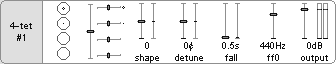

# Voice Architecture

This is an overall view of the voice architecture in **Polygon**. Read further for specifics on each of the listed controls, seen here as "external signals".

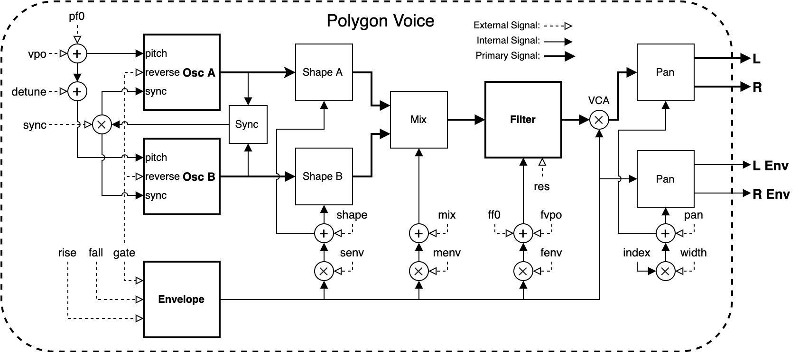

# Round Robin

The **Polygon** voices are controlled primarily by the "round robin" **gate** and **V/Oct** (the leftmost unit controls). These controls allow us to play the synth one voice at a time, avoiding the need to connect signals for each individual gate/vpo pair.

The voices can also be connected individually by holding the _M_ button over the associated unit controls. This will reveal a floating menu to select the desired voice:

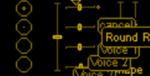

Notice that the selected voice for both the **gate** and **V/Oct** are linked, so choosing a voice on one or the other will cause both views to update.

Once a voice is selected, the **gate** and **V/Oct** fader for that voice will be highlighted. If round robin is selected then all voices will be highlighted.

Connections can be made to any or all of these controls at the same time for maximum flexibility.

## Gate

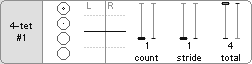

The **gate** view reveals the round robin step controls. By default, the round robin **gate** input will play each voice in turn, one after another. These controls are able to modify that behavior, allowing the round robin to step further, play multiple voices, or limit the range of voices it has access to:

* **count**: The number of adjacent voices that will react to the round robin gate. For example, setting this to 4 on the _4-tet_ configuration will play all 4 voices at once, sounding a chord.

* **stride**: The distance the round robin will travel after each step. Instead of stepping one by one, it can instead jump two or three voices at a time.

* **total**: The total number of voices available to the round robin, starting from the first voice. For example, a value of two will result in only the first and second voice being played, ignoring the others.

The large and small circles within the **gate** (and beside the **V/Oct** faders) indicate the currently active _round robin_ voice. The larger circle indicates the voice that is currently playing (or about to be played) and the small dot indicates the next in line. This provides good visual feedback for how the **count**/**stride**/**total** controls will affect playback.

### Voice Sync

One of the defining features of **polygon** is the way voice oscillators are synced when their **gate** opens. Instead of a hard sync, the oscillators instead reverse directions (soft sync) creating a much softer but still distinct striking sound. This gif shows how the gate on a single voice causes it to flip-flop characteristically:

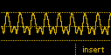

When rapidly **gate**ing the same voice, this flip can happen up to audio rate, producing some interesting waveforms:

## V/Oct

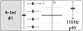

The **V/Oct** view reveals the **pfo** control, the fundamental pitch for all oscillators. When a voices **gate** is high, it's **V/Oct** will be tracked and held once the gate falls. The **pfo** is not subject to this, however, and can be modulated up to audio rate freely.

### Tracking

The **V/Oct** round robin sub-view contains a **track** toggle. Enabling this will cause the **V/Oct** offset of the currently active voice(s) to be hard-set to the round robin pitch. This is a quick way to program in offsets without having to switch one voice at a time.

Here a triangle oscillator modulates the round robin pitch while **track** is enabled. When the gate is open, the pitch of the corresponding voice is updated. When it closes, the pitch offset remains at the last seen value:

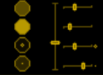

# Timbre (Shape / Detune)

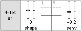

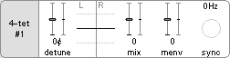

The timbre of the **Polygon** voice oscillators can be controlled using the **shape** and **detune** controls:

* **shape**: Transforms the oscillator shapes between triangle (**-1**), saw (**0**), and square (**1**).
  * **senv**: The degree to which **shape** is affected by the voice envelope.

 

* **detune**: Offsets the pitch of the secondary oscillator.
  * **mix**: The level of the primary and secondary oscillator. At **-1** only the primary oscillator will sound and at **1** only the secondary. At **0** they are mixed evenly.
  * **menv**: The degree to which **mix** is affected by the voice envelope.

# Envelope

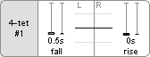

Each voice has a single AD envelope to control its level over time. When the voice **gate** goes high, the envelope will rise from its current value to the maximum and then fall from that value when the **gate** is released.

Internally this is modelled using a slew limiter / one-pole filter, giving a logarithmic rise and exponential fall off. Importantly this also means the **rise** and **fall** times are not strictly accurate, but just approximate the time it will take to move the envelope.

# Filter

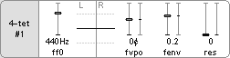

The filter used in **Polygon** is the same lowpass 12dB/Oct filter used in **Seive** (see the **Strike** package). The **res** (resonance) parameter provides a somewhat aggresive way to get the filter to self-oscillate. When using high resonance I strongly recommend using a limiter in front of **Polygon** to prevent clipping.

* **ffo**: The base filter frequency.
  * **fvpo**: The V/Oct offset from **ff0**.
    * **track**: Enable pitch tracking for the voice filters. Useful for playing the filter resonance in tune with the oscillator pitch.
  * **fenv**: The degree to which the filter is affected by the voice envelope. This is measured in V/Oct so **1**, for example, is 10 octaves.
  * **res**: The filter resonance, small values (< 0.5) are normally enough here to get the characteristic resonant sound.

# Output / Pan

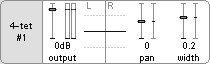

The final **Polygon** control adjusts the output level.

In a polyphonic synth it's important to account for the overall level since it can easily clip with many voices playing at once. To account for this the **auto** toggle enables automatic gain adjustment depending on how many voices are currently playing.

Using **auto** allows single voices to sound fully and the gain will automatically be dropped when more voices start playing. For this reason it's on by default.

Also available here are the **pan** controls:

* **pan**: The overall pan offset, shifting the entire output left (**-1**) or right (**1**).
* **width**: The stereo width of all voices. Lower numbered voices are panned closer to the center and higher numbered voices closer to the edge, alternating left and right.

