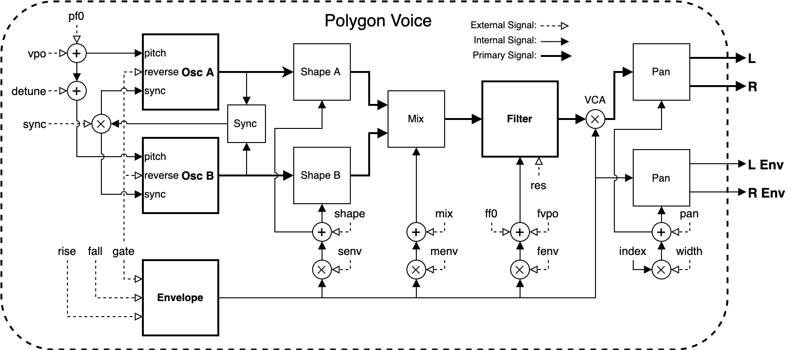
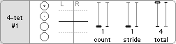
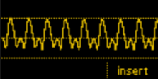
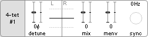

# Overview

**Polygon** is a polyphonic, dual oscillator synthesizer created in the DSP layer for the ER-301. It's provided in three variations:

* **4 voice** (*4-tet*): 11% CPU
* **8 voice** (*8-tet*): 17% CPU
* **12 voice** (*12-tet*): 23% CPU

## Voice Architecture

This is an overall view of the voice architecture in **polygon**. Read further for specifics on each of the listed controls, seen here as "external signals".

## Round Robin

The **Polygon** voices are controlled primarily by the "round robin" **gate** and **V/Oct** (the leftmost unit controls). The individual controls are also accessible by holding the associated _M_ button and turning the encoder to select a desired voice:

Notice that the selected voice for both the **gate** and **V/Oct** are linked, so choosing a voice on one or the other will cause both views to update. Once a voice is selected, the **gate** and **V/Oct** fader for that voice will be highlighted. If round robin is selected then all voices will be highlighted.

Connections can be made to any or all of these controls at the same time for maximum flexibility.

### Gate

The **gate** view reveals the round robin step controls. By default, the round robin **gate** input will play each voice in turn, one after another. These controls are able to modify that behavior, allowing the round robin to step further, play multiple voices, or limit the range of voices it has access to:

* **count**: The number of adjacent voices that will react to the round robin gate. For example, setting this to 4 on the _4-tet_ configuration will play all 4 voices at once, sounding a chord.

* **stride**: The distance the round robin will travel after each step. Instead of stepping one by one, it can instead jump two or three voices at a time.

* **total**: The total number of voices available to the round robin, starting from the first voice. Setting this to two, for example, will cause the it to only switch between the first and second voice, ignoring the others.

The large and small circles within the **gate** (and beside the **V/Oct** faders) indicate the currently active _round robin_ voice. The larger circle indicates the voice that is currently playing (or about to be played) and the small dot indicates the next in line. This provides good visual feedback for how the **count**/**stride**/**total** controls will affect playback.

One of the defining features of **polygon** is the way voice oscillators are synced when their **gate** opens. Instead of a hard sync, the oscillators instead reverse directions (soft sync) creating a much softer but still distinct striking sound. This gif shows how the gate on a single voice causes it to flip-flop characteristically:

When rapidly **gate**ing the same voice, this flip can happen up to audio rate, producing some interesting waveforms:

### V/Oct

The **V/Oct** view reveals the **pfo** control, the fundamental pitch for all oscillators. When a voices **gate** is high, it's **V/Oct** will be tracked and held once the gate falls. The **pfo** is not subject to this, however, and can be modulated up to audio rate freely.

The **V/Oct** round robin sub-view contains a **track** toggle. Enabling this will cause the **V/Oct** offset of the currently active voice(s) to be hard-set to the round robin pitch. This is a quick way to program in offsets without having to switch one voice at a time.

Here a triangle oscillator modulates the round robin pitch while **track** is enabled. When the gate is open, the pitch of the corresponding voice is updated. When it closes, the pitch offset remains at the last seen value:

## Timbre (Shape / Detune)

TODO

## Envelope

TODO

## Filter

TODO

## Output / Pan

TODO